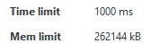

<!-- _class: title -->
# Ayudantía 1

---

<div align="center" style="font-size:60px;">

## Motivación

</div>

---

# ¿Que es programación competitiva?

<div style="display:flex;align-items:center;gap:20px;">

<div style="width:100%;">
    
</div>

<div style="width:100%;">
    <p>
    La Programación Competitiva es un deporte mental, en el que los participantes se sumergen en la emoción de resolver problemas desafiantes con especificaciones concretas en un tiempo limitado.
    </p>
</div>

</div>

---

# ¿De qué me sirve la programación competitiva?

<div style="display:flex;align-items:center;gap:20px;">


<div style="width:60%;">
    <p style="text-align:rigth;">
    La programación competitiva te ayuda a profundizar en temas avanzados de matemáticas y algoritmos, te brinda la habilidad de implementar soluciones complejas y entrena tu pensamiento lógico.
    </p>
</div>

<div style="width:40%;">
    
</div>

</div>

---

# ¿De qué me sirve en el futuro profesional?

Muchas grandes empresas requieren superar pruebas técnicas, que a menudo incluyen la resolución e implementación de algoritmos.

Además, las empresas buscan personas capaces de crear e implementar soluciones a problemas complejos, por lo que esta habilidad es fundamental.

---

# ¿Dónde puedo aprender más sobre programación competitiva?

La página más activa y con una amplia cantidad de problemas, recursos y tutoriales es Codeforces. En esta plataforma se realizan competencias con frecuencia, y la comunidad crea tutoriales para aprender temas avanzados.

<div style="display:flex;align-items:center;gap:20px;width:100%;justify-content:space-around;">

<div style="width:500px;">
    
</div>

<div style="width:500px;">
    
</div>

</div>

---

# ¿Que competencias existen?

<div style="display:flex;align-items:center;gap:20px;width:100%;justify-content:space-around;">

<div style="width:500px;">
    
</div>

<div style="width:500px;">
    
</div>

</div>

---

# ¿Que lenguajes de programación se usan?

## Top
1. C++ 
2. Python
3. Java

---

# ¿Por qué C++?

* Es un lenguaje rápido en comparación con Python u otros de alto nivel.
* La biblioteca estándar de C++ (STL) ofrece una amplia gama de funcionalidades y estructuras de datos.
* Permite programar soluciones eficientes y versátiles gracias a la STL.
* En mi experiencia con programación competitiva, nunca he necesitado usar punteros.

---


<div align="center" style="font-size:60px;">

## C++ y STL

</div>

---
# Estructura básica de un programa

```cpp
// Esta directiva incluye todas las bibliotecas estándar del lenguaje.
// Aunque no es óptima para desarrollar software complejo, 
// en programación competitiva nos ahorra mucho tiempo.
#include <bits/stdc++.h>

using namespace std;

int main() {
    cout << "Hola mundo" << endl;

    return 0;
}
```

---

# Estructuras de Datos - Vector

## ¿Cómo usar arreglos dinámicos sin punteros?

Podemos utilizar el contenedor `vector`, implementado en la STL de C++.

Se define de la siguiente manera:

```cpp
vector<tipo_de_dato> nombre_de_variable;
```

---

# Estructuras de Datos - Vector

```c++
vector<int> arr1; // Arreglo vacío de ints
vector<int> arr2(10); // Arreglo inicializado con 10 elementos
vector<int> arr3(8, -1); // Arreglo inicializado con 8 elementos, asignando -1 a todas las posiciones
vector<vector<string>> arr5; // Vector que almacena vectores de string
```

```c++
arr1.push_back(10); // Inserta 10 al final en O(1)
arr2.pop_back(); // Elimina el último elemento en O(1)
arr2[3] = 15; // Asigna 15 en la posición 3
arr2.clear(); // Elimina todos los elementos del vector
cout << arr3.size(); // Devuelve el tamaño del vector
```

---

# Estructuras de Datos - Vector

```c++
// Recorrer el vector usando un bucle for tradicional
for(int i = 0; i < arr1.size(); i++){
    cout << arr1[i] << endl;
}
// Recorrer el vector usando un foreach
for(int numero : arr1){
    cout << numero << endl;
}
```

---

# Estructuras de Datos - Queue

Una `queue` (cola) es un contenedor que sigue el principio FIFO (First In, First Out).

Se define de la siguiente manera:
```c++
queue<tipo_de_dato> nombre_de_variable;
```

---

# Estructuras de Datos - Queue

```c++
queue<int> cola;
```

```c++
cola.push(20); // Inserta el valor 20 al final de la cola
cout << cola.front() << endl; // Imprime el valor en el frente de la cola
cola.pop(); // Elimina el elemento al frente de la cola
cout << cola.size() << endl; // Devuelve la cantidad de elementos en la cola
cout << (cola.empty() ? "Cola vacía" : "Cola no vacía") << endl; // Verifica si la cola está vacía
```

---

# Estructuras de Datos - Stack

Una `stack` (pila) es un contenedor que sigue el principio LIFO (Last In, First Out).

Se define de la siguiente manera:

```c++
stack<tipo_de_dato> nombre_de_variable;
```

---

# Estructuras de Datos - Stack

```c++
stack<int> pila;
```

```cpp
pila.push(30); // Inserta el valor 30 en la pila
cout << pila.top() << endl; // Imprime el valor en el tope de la pila
pila.pop(); // Elimina el elemento en el tope de la pila

cout << pila.size() << endl; // Devuelve la cantidad de elementos en la pila
cout << (pila.empty() ? "Pila vacía" : "Pila no vacía") << endl; // Verifica si la pila está vacía
```

---

# Estructuras de Datos - Set

Un `set` es un contenedor que almacena elementos únicos en orden específico. 

Se define de la siguiente manera:

```cpp
set<tipo_de_dato> nombre_de_variable;
```

---

# Estructuras de Datos - Set

```c++
set<int> conjunto; // Orden de menor a mayor
set<int,greater<int>> alreves; // Orden de menor a mayor
```

```c++
conjunto.insert(15); // Inserta el valor 15 en el set
conjunto.insert(20); // Inserta el valor 20 en el set
conjunto.insert(10); // Inserta el valor 10 en el set
cout << conjunto.size() << endl; // Devuelve la cantidad de elementos en el set
cout << (conjunto.empty() ? "Set vacío" : "Set no vacío") << endl; // Verifica si el set está vacío
// Imprimir todos los elementos del set
for (int elemento : conjunto) {
    cout << elemento << " "; // Imprime cada elemento
}
cout << endl;
// Eliminar un elemento
conjunto.erase(20); // Elimina el elemento 20 del set
```

---

# Estructuras de Datos - Map

Un `map` es un contenedor que almacena pares clave-valor ordenados por las claves. 

Se define de la siguiente manera:

```c++
map<tipo_de_clave, tipo_de_valor> nombre_de_variable;
```

---

# Estructuras de Datos - Map

```c++
map<string, int> mapa;
```

```c++
mapa["manzanas"] = 10; // Asigna el valor 10 a la clave "manzanas"
mapa["naranjas"] = 5; // Asigna el valor 5 a la clave "naranjas"

cout << mapa["manzanas"] << endl; // Imprime el valor asociado a la clave "manzanas"
mapa.erase("naranjas"); // Elimina el par clave-valor con la clave "naranjas"

cout << mapa.size() << endl; // Devuelve la cantidad de elementos en el map
cout << (mapa.empty() ? "Mapa vacío" : "Mapa no vacío") << endl; // Verifica si el map está vacío

// Iteración sobre el map usando un foreach
for (auto par : mapa) {
    cout << "Clave: " << par.first << ", Valor: " << par.second << endl; // Imprime cada clave y su valor asociado
}
```

---

# Otros Tipos de Datos - Pair

Un `pair` es una estructura que puede contener dos valores de diferentes tipos. Se usa comúnmente para almacenar pares de datos relacionados, como coordenadas o claves y valores.

Definición y uso:

```cpp
pair<tipo_de_dato1, tipo_de_dato2> nombre_de_variable;
pair<int, string> par;

// Inicializar un par
par = make_pair(1, "uno");

// Acceso a elementos
cout << par.first << endl; // Imprime el primer elemento (1)
cout << par.second << endl; // Imprime el segundo elemento ("uno")
```

---

# Otros Tipos de Datos - Tuple

Una `tuple` es similar a un `pair`, pero puede contener múltiples valores de diferentes tipos. Esto es útil cuando necesitas agrupar más de dos valores.

Definición y uso:

```cpp
#include <tuple>
tuple<tipo_de_dato1, tipo_de_dato2, tipo_de_dato3> nombre_de_variable;
tuple<int, string, double> tupla;

// Inicializar una tupla
tupla = make_tuple(1, "uno", 3.14);

// Acceso a elementos
cout << get<0>(tupla) << endl; // Imprime el primer elemento (1)
cout << get<1>(tupla) << endl; // Imprime el segundo elemento ("uno")
cout << get<2>(tupla) << endl; // Imprime el tercer elemento (3.14)
```

---

# Algoritmos - Sort

La función `sort` es utilizada para ordenar elementos en un contenedor. Esta función es parte de la librería `<algorithm>` y proporciona ordenamientos rápidos y eficientes $O(nlog(n))$.

---

# Algoritmos - Sort

#### Ordenar en Orden Ascendente

```cpp
vector<int> numeros = {5, 2, 9, 1, 5, 6};

// Ordenar el vector en orden ascendente
sort(numeros.begin(), numeros.end());

// Imprimir el vector ordenado
cout << "Vector ordenado: ";
for (int num : numeros) {
    cout << num << " ";
}
cout << endl;
```

---

# Algoritmos - Sort

#### Ordenar en Orden Descendente

Para ordenar en orden descendente, puedes utilizar la función `greater<int>()` como tercer argumento:

```cpp
sort(numeros.begin(), numeros.end(), greater<int>());

cout << "Vector ordenado en orden descendente: ";
for (int num : numeros) {
    cout << num << " ";
}
cout << endl;
```

---

# Algoritmos - Sort

#### Ordenar con una Función de Comparación Personalizada

Puedes definir una función de comparación personalizada para ordenar elementos de acuerdo con un criterio específico. A continuación, se muestra un ejemplo de cómo ordenar un vector de pares de enteros según el segundo elemento de cada par:

---

# Algoritmos - Sort

```cpp
#include <bits/stdc++.h>
using namespace std;

bool compararPorSegundo(pair<int, int> a, pair<int, int> b) {
    return a.second < b.second;
}

int main() {
    vector<pair<int, int>> pares = {{1, 4}, {2, 2}, {3, 3}};
    sort(pares.begin(), pares.end(), compararPorSegundo);
    cout << "Vector de pares ordenado por el segundo elemento: ";
    for (pair<int,int> par : pares) {
        cout << "(" << par.first << ", " << par.second << ") ";
    }
    cout << endl;
    return 0;
}
```

---

<div align="center" style="font-size:60px;">

## ¿Cómo abordar un problema de programación competitiva?

</div>

---

# Partes del Problema

## Enunciado

Proporciona una descripción detallada del problema a resolver.


---

# Partes del Problema

## Entrada

Define el formato y las restricciones de la entrada. Puedes asumir que las restricciones siempre se cumplirán. La entrada debe ser leída desde la entrada estándar (por consola, usando `cin` o `input()`).


---

# Partes del Problema

## Salida

Especifica el formato de la salida que debe devolver el programa. La salida debe ser mostrada en la salida estándar (por consola, usando `cout` o `print()`).


---

# Partes del Problema

## Ejemplos

Se proporcionan casos de prueba públicos para verificar tu código. Sin embargo, al enviar tu solución, el juez evaluará tu código también con casos de prueba ocultos.


---

# Partes del Problema

## Tiempo Límite y Límite de Memoria

Cada problema tiene un tiempo límite y un límite de memoria. Si la solución excede estas restricciones, se rechazará con un error de TLE (Time Limit Exceeded) o MLE (Memory Limit Exceeded). Aproximadamente, $10^8$ operaciones toman un segundo.




