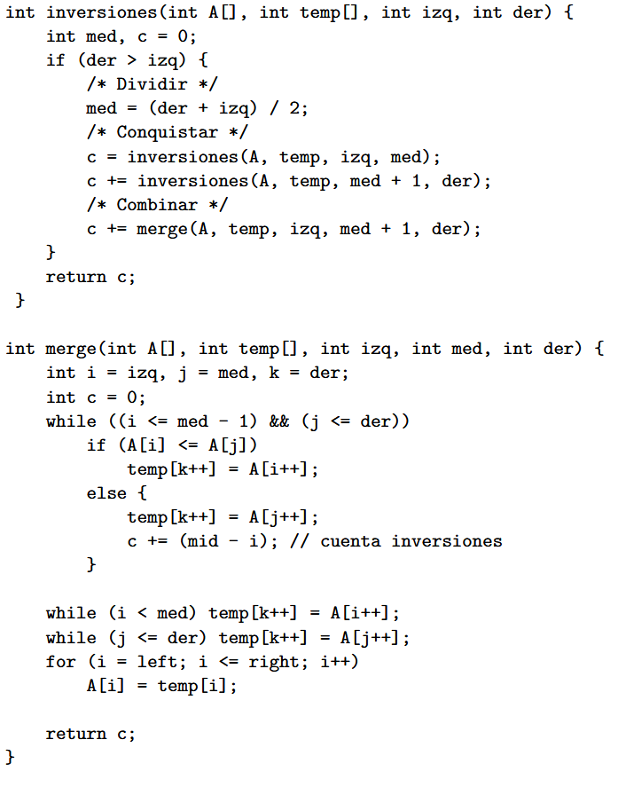

# Análisis Asintótico
## Ejercicio 1
Como se comentó en la ayudantía, para este ejercicio podemos asumir que $n$ es un cuadrado perfecto. Además, solo puedes considerar la cantidad de comparaciones.

### ¿Qué hace el algoritmo?

Al analizar el algoritmo podemos darnos cuenta de que lo que estamos haciendo es dividir la lista con largo $n$ en $\sqrt{n}$ pedazos de largo $\sqrt{n}$. La idea general del algoritmo es pasar por cada pedazo desde el más a la izquierda hasta el más a la derecha. Por cada bloque verificamos si el último elemento de ese bloque es menor que el número que estamos buscando, en el caso que no se cumpla, significa que pertenece a ese bloque. Al encontrar el pedazo, recorremos ese pedazo de izquierda a derecha hasta encontrar el número.

### ¿Cuál es el mejor caso?

El mejor caso es cuando el número que estamos buscando se encuentra al principio de la lista. Esto provocaría que esté en el primer bloque, por ende, el primer $while$ solo se evaluaría una vez y sería falso, por ende, se saldría de este bucle.

Luego, cuando comienza el $while$ para buscar el elemento en ese bloque, al estar en la primera posición, solo se ejecutaría una única vez y se saldría del bucle.

Si consideramos solo las relaciones de orden $\triangleleft$ y $\trianglelefteq$ , realizaríamos 2 comparaciones, por ende, el mejor caso pertenece a $\theta(1)$.

### ¿Cuál es el peor caso?

El peor caso es cuando el número que estamos buscando se encuentra en la última posición de la lista. Esto provocaría que se recorran todos los bloques hasta el último, y luego en ese bloque tendrías que pasar elemento por elemento hasta el final. 

En este caso, el primer $while$ se ejecutaría $\sqrt{n}$ veces y el segundo también, entonces si solo contamos las relaciones de orden  $\triangleleft$ y $\trianglelefteq$, realizaríamos $2\sqrt{n}$ comparaciones y esto pertenece a $\theta(\sqrt{n})$.

### ¿Cuál es el caso promedio?

**Caso 1:** Número encontrado con éxito
Calcularemos la sumatoria de los tiempos de casos de éxito.
Los casos de éxito son en los que sí existe el número en la lista, por ende, hay $n$ posibilidades.

$$
\sum_{i = 1}^{\sqrt{n}}
\sum_{j = 1}^{\sqrt{n}} (i + j) =
\sum_{i = 1}^{\sqrt{n}} \left( \sqrt{n} \cdot i + \frac{\sqrt{n} \cdot (\sqrt{n} + 1)}{2} \right) = 
$$

$$
\sqrt{n} \cdot \frac{\sqrt{n} \cdot (\sqrt{n} + 1)}{2} + n\frac{\sqrt{n} + 1}{2} = 
$$

$$
n \cdot \frac{\sqrt{n} + 1}{2} + n\cdot\frac{\sqrt{n} + 1}{2} = \frac{n}{2} \cdot \left( 2\sqrt{n} + 2 \right) = n\sqrt{n} + n
$$

**Caso 2:** Número encontrado sin éxito
Calcularemos la sumatoria de los tiempos de casos sin éxito.
Para este caso tenemos que tener en cuenta que siempre en un caso de fracaso vamos a entrar a un bloque o no entraremos a ninguno, lo recorreremos todo y no encontraremos el número. Podemos observar que hay $\sqrt{n}$  + 1 posibilidades, por lo cual podemos expresar la siguiente sumatoria:

$$
\sqrt{n} + \sum_{i = 1}^{\sqrt{n}} (i +  \sqrt{n}) = 
\sqrt{n} +\frac{\sqrt{n} \cdot (\sqrt{n} + 1)}{2} +  n = \\
\sqrt{n} + \frac{n + \sqrt{n}}{2} + n 
$$

#### Conclusión

Si juntamos ambas expresiones para promediarlo, obtenemos lo siguiente:

$$
T(n) = \frac{n\sqrt{n} + n + \sqrt{n} + \frac{n + \sqrt{n}}{2} + n}{n + \sqrt{n} + 1} =
$$

$$
\frac{2n\sqrt{n} + 4n + 2\sqrt{n} + n + \sqrt{n}}{2n + 2\sqrt{n} + 2} = 
$$

$$
\frac{2n\sqrt{n} + 5n + 3\sqrt{n}}{2n + 2\sqrt{n} + 2} = 
$$

$$
\frac{\sqrt{n} \cdot (2n + 5\sqrt{n} + 3)}{2n + 2\sqrt{n} + 2} \leq 
\frac{\sqrt{n} \cdot (2n + 5\sqrt{n} + 3)}{2n + 5\sqrt{n} + 3} = \sqrt{n} \in O(\sqrt{n})
$$

Podemos observar que al sacar el caso promedio general, tomando en cuenta el caso de éxito y de fracaso, es un cálculo muy complejo, pero en muchos ejercicios solo te piden el caso promedio de solo éxito o de solo fracaso, lo cual lo hace un poco más simple. :)

**Para responder las preguntas 3 y 4, simplemente se deben dividir los casos según la cantidad de posibilidades..**

## Ejercicio 2

**Esto es un reto...**

Hint: https://cp-algorithms.com/data_structures/sqrt_decomposition.html

# Análisis Amortizado

## Ejercicio 1

Podemos observar que por cada operación tenemos el siguiente comportamiento: 

$$
f(n) = \begin{cases} 
n, & \text{si } \exists k \in \mathbb{Z}, \text{ tal que } n = 2^k \\
1, & \text{en caso contrario.}
\end{cases}
$$

Podríamos obtener una expresión que nos dé la cantidad de números que son potencias de 2 entre $ [1,n] $.

Para sacar esto podemos tener en cuenta que para obtener el máximo exponente entero de forma que la potencia a ese exponente sea menor o igual a $n$, usaremos la expresión $\lfloor \log_{2}{n} \rfloor$, pero esto no nos da la cantidad de potencias totales, para obtener esto simplemente hay que sumar 1 para considerar el $2^0$:

$$
X = \lfloor \log_{2}{n} \rfloor + 1
$$

Ahora con esto podemos obtener la siguiente expresión para el promedio:

$$
\frac{T(n)}{n} = 
\left( \sum_{i = 0}^{X} 2^i + n - X  \right)/n =
\frac{
    \frac{2^{X + 1} - 1}{2 - 1} + n - X
}{
    n
}
$$

$$
\frac{
    \frac{2^{\lfloor \log_{2}{n} \rfloor + 1 + 1} - 1}{1} + n - \lfloor \log_{2}{n} \rfloor - 1
}{
    n
} \leq \frac{
    \frac{2^{ \log_{2}{n} + 1 + 1} - 1}{1} + n - \log_{2}{n} - 1
}{
    n
} =
\frac{
    4n + n -  \log_{2}{n}  - 1
}{
    n
}
$$

$$
\frac{
    5n - \log_{2}{n} - 1
}{
    n
} \leq 
\frac{
    5n
}{
    n
} = 5 \in O(1)
$$

## Ejercicio 2

_Podemos asumir que copiar un solo elemento en otro lugar es O(1)._

El peor caso que se puede considerar es que las $k$ operaciones sean solo de inserción, ya que si hay extracción, la cantidad de elementos que se copiarán en otro sector de memoria será menor.

Como podemos observar, cada elemento tendrá el siguiente flujo:
- Entrará un elemento a la pila.
- Se realizará una copia del elemento.

$$
\frac{T(n)}{n} = \frac{2k}{k} = 2 \in O(1)
$$

Con lo anterior, podemos demostrar que el costo amortizado por operación es $O(1)$.

# Dividir y Conquistar

## Ejercicio 1

En este problema, podemos realizar búsqueda binaria para encontrar la respuesta.

Para esto, definiremos la siguiente función:

$$ 
f(i) = \text{la cantidad máxima de productos que puedo realizar en } i \text{ segundos} 
$$

Podemos observar de la función anterior que sigue el siguiente comportamiento para todo $i$:

$$ 
f(i - 1) \leq f(i) \leq f(i + 1) 
$$

Es decir, es una función monótona. Entonces, de esta forma, se parece mucho al problema anterior. Sabemos que queremos producir $t$ productos.

Entonces, si $f(i) \geq t$, esto nos indica que en $i$ segundos se puede satisfacer la demanda.

Lo que queremos encontrar es el mínimo $i$ que cumpla la condición $f(i) \geq t$. Podemos utilizar búsqueda binaria y, en el caso de que $f(\text{mitad}) \geq t$, sabemos que mitad es una posible respuesta. Entonces, continuamos la búsqueda desde $x$ hasta $\text{mitad} - 1$. En caso contrario, continuamos la búsqueda en la otra mitad.

Un intervalo posible para realizar la búsqueda puede ser el siguiente: $[1, A_{\text{max}} \cdot t]$.

### Complejidad

La complejidad para calcular $f(i)$ es $O(n)$. Al realizar búsqueda binaria se evalúa $f$ $O(\log(A_{\text{max}} \cdot t))$ veces, entonces la complejidad final es $O(n \log(A_{\text{max}} \cdot t))$.

### Código


```python
def busqueda_binaria(izquierda, derecha, maquinas, t):
    if izquierda > derecha:
        return float("inf")
    mitad = (izquierda + derecha) // 2
    produccion = 0
    for maquina in maquinas:
        produccion += mitad // maquina
    if produccion >= t:
        return min(mitad, busqueda_binaria(izquierda, mitad - 1, maquinas, t))
    return busqueda_binaria(mitad + 1, derecha, maquinas, t)
 
n, t = list(map(int, input().split()))
maquinas = list(map(int, input().split()))
 
izquierda = 0
derecha = max(maquinas) * t
 
print(busqueda_binaria(izquierda, derecha, maquinas, t))
```

## Ejercicio 2



