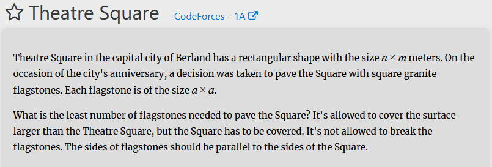
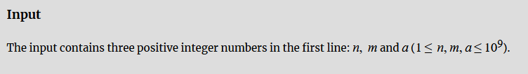
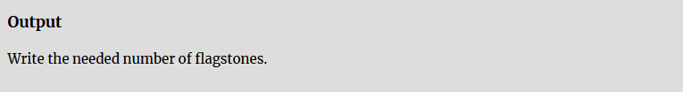
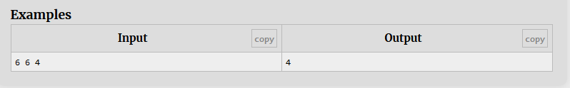

<!-- _class: title -->
# Ayudantía 1
- Carlos Lagos - carlos.lagosc@usm.cl  
- Nangel Coello - nangel.coello@usm.cl  
- Rafael Baeza - rafael.baezam@usm.cl  
- Benjamín Cárdenas - benjamin.cardenas@usm.cl 

---

# Contenido

1. Uso del juez en línea y estructura de los problemas
2. Introducción a la Biblioteca Estándar de C++: STL
    1. Contenedores
    2. Iteradores
    3. Algoritmos

---

## Uso del juez en línea y estructura de los problemas

---

# Partes de un Problema

## Enunciado

Proporciona una descripción detallada del problema a resolver.



---

# Partes de un Problema

## Entrada

Define el formato y las restricciones de la entrada. Puedes asumir que las restricciones siempre se cumplirán. La entrada debe ser leída desde la entrada estándar (por consola, usando `cin` o `input()`).



---

# Partes de un Problema

## Salida

Especifica el formato de la salida que debe devolver el programa. La salida debe ser mostrada en la salida estándar (por consola, usando `cout` o `print()`).



---

# Partes de un Problema

## Ejemplos

Se proporcionan casos de prueba públicos para verificar tu código. Sin embargo, al enviar tu solución, el juez evaluará tu código también con casos de prueba ocultos.



---

# Partes de un Problema

## Tiempo Límite y Límite de Memoria

Cada problema tiene un tiempo límite y un límite de memoria. Si la solución excede estas restricciones, se rechazará con un error de TLE (Time Limit Exceeded) o MLE (Memory Limit Exceeded). Aproximadamente, $10^8$ operaciones toman un segundo.


---

# Contest de Ejemplo  

Puedes acceder al siguiente contest de ejemplo para practicar lo visto anteriormente y reforzar los conceptos que abordaremos en esta ayudantía.  

[https://vjudge.net/contest/705099](https://vjudge.net/contest/705099)

---

## Introducción a la Biblioteca Estándar de C++: STL

---

# ¿Qué es la STL?

>Es un conjunto de clases y funciones basadas en plantillas (templates).
>>Implementa **estructuras de datos** y **algoritmos** básicos (listas, pilas, colas, búsqueda, orden, etc).<br>
>>Además agrega objetos iteradores para operar y/o acceder a las estructuras de datos.

---

# Beneficios de la STL

- **Código genérico y reutilizable:** Escribe algoritmos que funcionan con múltiples tipos.
- **Enfoque en la solución de problemas:** Menos código de bajo nivel y más énfasis en la lógica.
- **Gestión de memoria:** Reduce errores comunes como pérdidas de memoria.

---

# Limitaciones de la STL

- **Sobrecarga de rendimiento:** La generalidad puede afectar la eficiencia en casos específicos.
- **Complejidad al depurar:** Las abstracciones pueden dificultar la identificación de errores.
- **Control de memoria:** Menor control sobre detalles de asignación y liberación.
- **Integración con estructuras personalizadas:** Algunas estructuras a medida pueden requerir soluciones específicas.
---

# Componentes de la STL

La STL se compone de 3 elementos principales:

1. **Contenedores**
2. **Iteradores**
3. **Algoritmos**  

---

## Contenedores

---

# Contenedores

- **Contenedores de secuencia**
Array, Vector, Deque, List, Forward List
- **Adaptadores de contenedores**  
Stack, Queue, Priority Queue
- **Contenedores asociativos**  
Set, Map, Multiset, Multimap
- **Contenedores asocitavos desordenados**
Unordered Set, Unordered Map, Unordered Multiset, Unordered Multimap

---

# Contenedores - Vector

## ¿Cómo usar arreglos dinámicos sin punteros?

Podemos utilizar el contenedor `vector`, implementado en la STL de C++.

Se define de la siguiente manera:

```cpp
vector<tipo_de_dato> nombre_de_variable;
```

---

# Contenedores - Vector

```c++
vector<int> arr1; // Arreglo vacío de ints
vector<int> arr2(10); // Arreglo inicializado con 10 elementos
vector<int> arr3(8, -1); // Arreglo inicializado con 8 elementos, asignando -1 a todas las posiciones
vector<vector<string>> arr5; // Vector que almacena vectores de string

arr1.push_back(10); // Inserta 10 al final en O(1)
arr2.pop_back(); // Elimina el último elemento en O(1)
arr2[3] = 15; // Asigna 15 en la posición 3
arr2.clear(); // Elimina todos los elementos del vector
cout << arr3.size(); // Devuelve el tamaño del vector
```

---

# Contenedores - Vector

```c++
// Recorrer el vector usando un bucle for tradicional
for(int i = 0; i < arr1.size(); i++){
    cout << arr1[i] << endl;
}
// Recorrer el vector usando un foreach
for(int numero : arr1){
    cout << numero << endl;
}
```

---

# Contenedores - Queue

Una `queue` (cola) es un contenedor que sigue el principio FIFO (First In, First Out).

Se define de la siguiente manera:
```c++
queue<tipo_de_dato> nombre_de_variable;
```

---

# Contenedores - Queue

```c++
queue<int> cola;

cola.push(20); // Inserta el valor 20 al final de la cola
cout << cola.front() << endl; // Imprime el valor en el frente de la cola
cola.pop(); // Elimina el elemento al frente de la cola
cout << cola.size() << endl; // Devuelve la cantidad de elementos en la cola
cout << (cola.empty() ? "Cola vacía" : "Cola no vacía") << endl; // Verifica si la cola está vacía
```

---

# Contenedores - Stack

Una `stack` (pila) es un contenedor que sigue el principio LIFO (Last In, First Out).

Se define de la siguiente manera:

```c++
stack<tipo_de_dato> nombre_de_variable;
```

---

# Contenedores - Stack

```c++
stack<int> pila;

pila.push(30); // Inserta el valor 30 en la pila
cout << pila.top() << endl; // Imprime el valor en el tope de la pila
pila.pop(); // Elimina el elemento en el tope de la pila

cout << pila.size() << endl; // Devuelve la cantidad de elementos en la pila
cout << (pila.empty() ? "Pila vacía" : "Pila no vacía") << endl; // Verifica si la pila está vacía
```

---

# Contenedores - Set

Un `set` es un contenedor que almacena elementos únicos en orden específico. 

Se define de la siguiente manera:

```cpp
set<tipo_de_dato> nombre_de_variable;
```

---

# Contenedores - Set

```c++
set<int> conjunto; // Orden de menor a mayor
set<int,greater<int>> alreves; // Orden de menor a mayor

conjunto.insert(15); // Inserta el valor 15 en el set
conjunto.insert(20); // Inserta el valor 20 en el set
conjunto.insert(10); // Inserta el valor 10 en el set
cout << conjunto.size() << endl; // Devuelve la cantidad de elementos en el set
cout << (conjunto.empty() ? "Set vacío" : "Set no vacío") << endl; // Verifica si el set está vacío
// Imprimir todos los elementos del set
for (int elemento : conjunto) {
    cout << elemento << " "; // Imprime cada elemento
}
cout << endl;
// Eliminar un elemento
conjunto.erase(20); // Elimina el elemento 20 del set
```

---

# Contenedores - Set

```c++
// Uso de lower_bound
auto it_lower = conjunto.lower_bound(12); // Encuentra el primer elemento no menor que 12
if (it_lower != conjunto.end()) {
    cout << "El primer elemento no menor que 12 es: " << *it_lower << endl;
} else {
    cout << "No hay elementos no menores que 12 en el set" << endl;
}
// Uso de upper_bound
auto it_upper = conjunto.upper_bound(12); // Encuentra el primer elemento mayor que 12
if (it_upper != conjunto.end()) {
    cout << "El primer elemento mayor que 12 es: " << *it_upper << endl;
} else {
    cout << "No hay elementos mayores que 12 en el set" << endl;
}
```

---

# Contenedores - Map

Un `map` es un contenedor que almacena pares clave-valor ordenados por las claves. 

Se define de la siguiente manera:

```c++
map<tipo_de_clave, tipo_de_valor> nombre_de_variable;
```

---

# Contenedores - Map

```c++
map<string, int> mapa;

mapa["manzanas"] = 10; // Asigna el valor 10 a la clave "manzanas"
mapa["naranjas"] = 5; // Asigna el valor 5 a la clave "naranjas"

cout << mapa["manzanas"] << endl; // Imprime el valor asociado a la clave "manzanas"
mapa.erase("naranjas"); // Elimina el par clave-valor con la clave "naranjas"

cout << mapa.size() << endl; // Devuelve la cantidad de elementos en el map
cout << (mapa.empty() ? "Mapa vacío" : "Mapa no vacío") << endl; // Verifica si el map está vacío

// Iteración sobre el map usando un foreach
for (auto par : mapa) {
    cout << "Clave: " << par.first << ", Valor: " << par.second << endl; // Imprime cada clave y su valor asociado
}
```

---

# Otros Tipos de Datos - Pair

Un `pair` es una estructura que puede contener dos valores de diferentes tipos. Se usa comúnmente para almacenar pares de datos relacionados, como coordenadas o claves y valores.

Definición y uso:

```cpp
pair<tipo_de_dato1, tipo_de_dato2> nombre_de_variable;
pair<int, string> par;

// Inicializar un par
par = make_pair(1, "uno");

// Acceso a elementos
cout << par.first << endl; // Imprime el primer elemento (1)
cout << par.second << endl; // Imprime el segundo elemento ("uno")
```

---

# Otros Tipos de Datos - Tuple

Una `tuple` es similar a un `pair`, pero puede contener múltiples valores de diferentes tipos. Esto es útil cuando necesitas agrupar más de dos valores.

Definición y uso:

```cpp
#include <tuple>
tuple<tipo_de_dato1, tipo_de_dato2, tipo_de_dato3> nombre_de_variable;
tuple<int, string, double> tupla;

// Inicializar una tupla
tupla = make_tuple(1, "uno", 3.14);

// Acceso a elementos
cout << get<0>(tupla) << endl; // Imprime el primer elemento (1)
cout << get<1>(tupla) << endl; // Imprime el segundo elemento ("uno")
cout << get<2>(tupla) << endl; // Imprime el tercer elemento (3.14)
```

---

## Iteradores
Objetos similares a punteros que sirven para recorrer los contenedores.

---

# Iteradores

Un **iterador** en C++ es un objeto que permite recorrer una estructura de datos de manera secuencial. Aunque los iteradores son similares a los punteros porque permiten acceder a los elementos de una estructura, se diferencian en que ofrecen más funcionalidades y son más fáciles de usar. A diferencia de los punteros, los iteradores no almacenan directamente direcciones de memoria. **No es necesario definir memoria dinámica para usarlos.**

---

# Iteradores - Acceder al valor

Dado un iterador 'it', para acceder a su valor se hace de la misma forma que con los punteros, es decir, utilizando '*it' y, en caso de que el valor sea un `struct` o algo similar, se puede utilizar 'it->valor'.

---

# Iteradores - Sumar

Se puede utilizar '++' para ir al siguiente elemento y '--' para retroceder. Por ejemplo, dado el iterador 'it', si utilizamos 'it++' en el siguiente vector:

| Etapa   | 1  | 2  | 4  | 6  | 7  | END |
| ------- | -- | -- | -- | -- | -- | --- |
| Antes   |    | it |    |    |    |     |
| Después |    |    | it |    |    |     |

---

# Iteradores - Resta

En algunos contenedores (no todos), se pueden restar.

```c++
/*
1   2   4   6   7   END
    it1     it2
*/
int diff = it2 - it1;
// diff -> 2
```


---

<style scoped>
    pre{
        font-size:18px;
    }
</style>

# Iteradores - Ejemplo

```c++
#include <bits/stdc++.h>
using namespace std;

int main(){
    vector<int> numeros = {1,2,3,4,5};
    
    // Invierte el vector
    reverse(nums.begin(),nums.end());

    set<int> conjunto = {1,7,10};

    for(auto it = numeros.begin(); it != numeros.end(); it++){
        cout << *it << endl;
    }

    for(auto it = conjunto.begin(); it != conjunto.end(); it++){
        cout << *it << endl;
    }

    return 0;
}

```


---

## Algoritmos

---

# Algoritmos Manipulativos (Modifican los elementos)

<style scoped>
table{
    font-size:20px;
}
</style>

<div style="display:flex; justify-content:center;">

|**Función**|**Operación**|
|-----------|-------------|
|**sort**| Ordena los elementos de un vector o arreglo en $O(nlog(n))$ |
|**copy**| Copia elementos de un rango a otro.|
|**fill**| Asigna un valor a todos los elementos de un rango.|
|**transform**| Aplica una función a cada elemento.|
|**replace**| Reemplaza elementos por un nuevo valor.|
|**swap**|Intercambia el contenido de dos variables.|
|**reverse**|Invierte el orden de los elementos.|
|**rotate**|Rota los elementos de un rango.|
|**remove**|Elimina elementos con un valor específico.|
|**unique**| Elimina duplicados consecutivos.|

</div>

---

# Algoritmos - Sort

La función `sort` es utilizada para ordenar elementos en un contenedor. Esta función es parte de la librería `<algorithm>` y proporciona ordenamientos rápidos y eficientes $O(nlog(n))$.

---

# Algoritmos - Sort

#### Ordenar en Orden Ascendente

```cpp
vector<int> numeros = {5, 2, 9, 1, 5, 6};

// Ordenar el vector en orden ascendente
sort(numeros.begin(), numeros.end());

// Imprimir el vector ordenado
cout << "Vector ordenado: ";
for (int num : numeros) {
    cout << num << " ";
}
cout << endl;
```

---

# Algoritmos - Sort

#### Ordenar en Orden Descendente

Para ordenar en orden descendente, puedes utilizar la función `greater<int>()` como tercer argumento:

```cpp
sort(numeros.begin(), numeros.end(), greater<int>());

cout << "Vector ordenado en orden descendente: ";
for (int num : numeros) {
    cout << num << " ";
}
cout << endl;
```

---

# Algoritmos - Sort

#### Ordenar con una Función de Comparación Personalizada

Puedes definir una función de comparación personalizada para ordenar elementos de acuerdo con un criterio específico. A continuación, se muestra un ejemplo de cómo ordenar un vector de pares de enteros según el segundo elemento de cada par:

---

# Algoritmos - Sort

```cpp
#include <bits/stdc++.h>
using namespace std;

bool compararPorSegundo(pair<int, int> a, pair<int, int> b) {
    return a.second < b.second;
}

int main() {
    vector<pair<int, int>> pares = {{1, 4}, {2, 2}, {3, 3}};
    sort(pares.begin(), pares.end(), compararPorSegundo);
    cout << "Vector de pares ordenado por el segundo elemento: ";
    for (pair<int,int> par : pares) {
        cout << "(" << par.first << ", " << par.second << ") ";
    }
    cout << endl;
    return 0;
}
```

---

# Algoritmos - Reverse

La función `reverse` invierte el orden de los elementos en un contenedor.

```cpp
vector<int> numeros = {1, 2, 3, 4, 5};

// Invertir el vector
reverse(numeros.begin(), numeros.end());

// Imprimir el vector invertido
cout << "Vector invertido: ";
for (int num : numeros) {
    cout << num << " ";
}
cout << endl;
```

---

<style scoped>
pre{
    font-size:20px;
}
</style>

# Algoritmos - Copy


```c++
#include<vector>
#include<algorithm>
#include<iostream>

using namespace std;

int main(){
    vector<int> ejemplo = {1, 2, 3, 4, 5, 6, 7};
    vector<int> copia_ejemplo(ejemplo.size());

    copy(ejemplo.begin(), ejemplo.end(), copia_ejemplo.begin());
    reverse(copia_ejemplo.begin(), copia_ejemplo.end());

    for(int i : copia_ejemplo) cout << i << ' ';

    return 0;
}

//output: 7 6 5 4 3 2 1
```

---

<style scoped>
table{
    font-size:20px;
}
</style>

# Algoritmos No Manipulativos (Operan sin modificar)

<div style="display:flex; justify-content:center;">

| **Función**| **Operación**|
|------------|--------------|
|**lower_bound**|Encuentra el valor mas a la izquierda que es mayor o igual a x.|
|**upper_bound**|Encuentra el valor mas a la izquierda que es mayor a x.|
|**max_element**|Encuentra el elemento máximo.|
|**min_element**|Encuentra el elemento mínimo.|
|**accumulate**|Suma los elementos de un rango.|
|**count**|Cuenta ocurrencias de un elemento.|
|**find**| Busca el primer elemento que cumple una condición.|
|**is_permutation**|Comprueba si dos rangos son permutaciones.|
|**is_sorted**|Verifica si un rango está ordenado.|
|**partial_sum**|Calcula la suma acumulada.|

</div>

---

# Algoritmos - Lower Bound y Upper Bound

Las funciones `lower_bound` y `upper_bound` se utilizan para buscar elementos en contenedores ordenados. `lower_bound` devuelve un iterador al primer elemento que no es menor que el valor especificado, mientras que `upper_bound` devuelve un iterador al primer elemento mayor que el valor especificado.

---

# Algoritmos - Lower Bound y Upper Bound

```cpp
vector<int> numeros = {1, 2, 4, 4, 5, 6, 7};

auto it_lower = lower_bound(numeros.begin(), numeros.end(), 4);
auto it_upper = upper_bound(numeros.begin(), numeros.end(), 4);

cout << "Lower bound de 4: " << distance(numeros.begin(), it_lower) << endl; // Índice del primer 4
cout << "Upper bound de 4: " << distance(numeros.begin(), it_upper) << endl; // Índice del primer elemento mayor que 4
```

---

<div align="center">
<h2 style="font-size:400px;">FIN</h2>
</div>