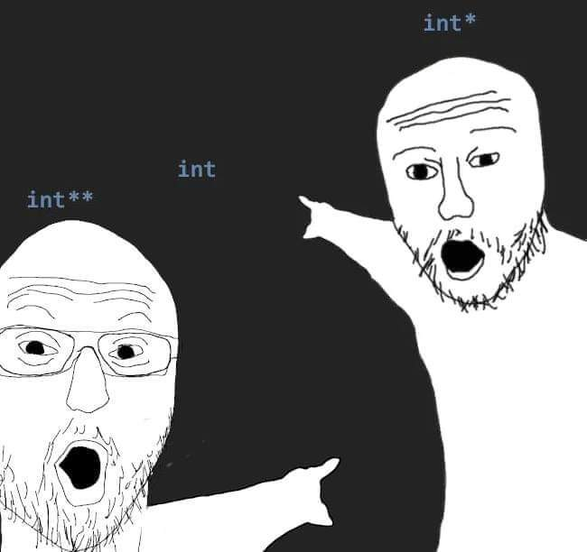

<!-- _class: title -->

# Ayudantía 2

Carlos Lagos - [carlos.lagosc@usm.cl](mailto:carlos.lagosc@usm.cl)

---

# Punteros

<div style="display:flex;">

<div style="width:50%; font-size:25px;">

* **¿Qué son los punteros?**
  * Tipos de datos que almacenan la dirección de memoria de una variable.

* **¿Para qué sirven?**
  * Manejar memoria dinámica.
  * Implementar estructuras de datos más complejas (listas enlazadas, árboles binarios, etc.).

* **¿Pero si la STL nos brinda estructuras de datos, podemos evitarlos?**
  * Sí, casi siempre.


</div>

<div style="width:50%; display:flex; align-items:center; justify-content:center;">



</div>

</div>

---

# ¿Qué es la STL?

Aquí tienes una versión apenas más clara y un poco más completa, sin extender demasiado:

---

# ¿Qué es la STL?

La **Standard Template Library (STL)** de C++ es un conjunto de **clases, contenedores y algoritmos genéricos** que permiten trabajar de forma eficiente con colecciones de datos. Proporciona herramientas listas para usar, evitando tener que implementar estructuras de datos y operaciones comunes desde cero.

---

# Ejemplo

```c++
// Incluye solo lo necesario (mejor para proyectos que se mantendrán):
// #include <iostream>
// #include <vector>
// Incluye toda la STL (útil para código rápido o que solo se usará una vez)
#include <bits/stdc++.h>
using namespace std;

int main() {
    int n;
    cin >> n; // leer cantidad de números
    vector<int> numeros; // Arreglo dinámico de enteros
    // leer los números y guardarlos en el vector
    for (int i = 0; i < n; i++) {
        int num; cin >> num;
        numeros.push_back(num);
    }
    // imprimir los números
    for (int num : numeros) {
        cout << num << " ";
    }
    cout << endl;
    return 0;
}

```

---

# Contenedores STL

Los **contenedores STL** en C++ son estructuras de datos genéricas que facilitan almacenar y organizar elementos. Se dividen en **básicos** (como `vector`, `list`, `map`) y **adaptadores** (como `stack`, `queue`), permitiendo usar estructuras comunes de forma eficiente sin implementarlas desde cero.

---

# Iteradores en C++

- Permiten recorrer contenedores STL como si fueran punteros (pero mas facil).
- Abstracción de los datos: acceso sin conocer la implementación interna.

---

# Ejemplo

```cpp
vector<int> v = {1,2,3,4};

// Iterador normal
for(auto it = v.begin(); it != v.end(); ++it)
    cout << *it << ' ';

// Iterador inverso
for(auto rit = v.rbegin(); rit != v.rend(); ++rit)
    cout << *rit << ' ';

// const_iterator (solo lectura)
for(auto cit = v.cbegin(); cit != v.cend(); ++cit)
    cout << *cit << ' ';

```

---

# Contenedores - Vector

## ¿Cómo usar arreglos dinámicos sin punteros?

Podemos utilizar el contenedor `vector`, implementado en la STL de C++.

Se define de la siguiente manera:

```cpp
vector<tipo_de_dato> nombre_de_variable;
```

---

# Contenedores - Vector

```c++
vector<int> arr1; // Arreglo vacío de ints
vector<int> arr2(10); // Arreglo inicializado con 10 elementos
vector<int> arr3(8, -1); // Arreglo inicializado con 8 elementos, asignando -1 a todas las posiciones
vector<vector<string>> arr5; // Vector que almacena vectores de string

arr1.push_back(10); // Inserta 10 al final en O(1)
arr2.pop_back(); // Elimina el último elemento en O(1)
arr2[3] = 15; // Asigna 15 en la posición 3
arr2.clear(); // Elimina todos los elementos del vector
cout << arr3.size(); // Devuelve el tamaño del vector
```

---

# Contenedores - Vector

```c++
// Recorrer el vector usando un bucle for tradicional
for(int i = 0; i < arr1.size(); i++){
    cout << arr1[i] << endl;
}
// Recorrer el vector usando un foreach
for(int numero : arr1){
    cout << numero << endl;
}
```

---

# Contenedores - Queue

Una `queue` (cola) es un contenedor que sigue el principio FIFO (First In, First Out).

Se define de la siguiente manera:

```c++
queue<tipo_de_dato> nombre_de_variable;
```

---

# Contenedores - Queue

```c++
queue<int> cola;

cola.push(20); // Inserta el valor 20 al final de la cola
cout << cola.front() << endl; // Imprime el valor en el frente de la cola
cola.pop(); // Elimina el elemento al frente de la cola
cout << cola.size() << endl; // Devuelve la cantidad de elementos en la cola
cout << (cola.empty() ? "Cola vacía" : "Cola no vacía") << endl; // Verifica si la cola está vacía
```

---

# Contenedores - Stack

Una `stack` (pila) es un contenedor que sigue el principio LIFO (Last In, First Out).

Se define de la siguiente manera:

```c++
stack<tipo_de_dato> nombre_de_variable;
```

---

# Contenedores - Stack

```c++
stack<int> pila;

pila.push(30); // Inserta el valor 30 en la pila
cout << pila.top() << endl; // Imprime el valor en el tope de la pila
pila.pop(); // Elimina el elemento en el tope de la pila

cout << pila.size() << endl; // Devuelve la cantidad de elementos en la pila
cout << (pila.empty() ? "Pila vacía" : "Pila no vacía") << endl; // Verifica si la pila está vacía
```

---

# Contenedores - Set

Un `set` es un contenedor que almacena elementos únicos en orden específico.

Se define de la siguiente manera:

```c++
set<tipo_de_dato> nombre_de_variable;
```

---

# Contenedores - Set

```c++
set<int> conjunto; // Orden de menor a mayor
set<int,greater<int>> alreves; // Orden inverso

conjunto.insert(15); // Inserta el valor 15 en el set
conjunto.insert(20); // Inserta el valor 20 en el set
conjunto.insert(10); // Inserta el valor 10 en el set
cout << conjunto.size() << endl; // Devuelve la cantidad de elementos en el set
cout << (conjunto.empty() ? "Set vacío" : "Set no vacío") << endl; // Verifica si el set está vacío

// Imprimir todos los elementos del set
for (int elemento : conjunto) {
    cout << elemento << " "; // Imprime cada elemento
}
cout << endl;
// Eliminar un elemento
conjunto.erase(20); // Elimina el elemento 20 del set
```

---

# Contenedores - Set (Extras)

```c++
// Uso de lower_bound y upper_bound
auto it_lower = conjunto.lower_bound(12);
if (it_lower != conjunto.end()) cout << *it_lower << endl;

auto it_upper = conjunto.upper_bound(12);
if (it_upper != conjunto.end()) cout << *it_upper << endl;
```

---

# Contenedores - Map

Un `map` es un contenedor que almacena pares clave-valor ordenados por las claves.

```c++
map<tipo_de_clave, tipo_de_valor> nombre_de_variable;
```

---

# Contenedores - Map

```c++
map<string, int> mapa;

mapa["manzanas"] = 10;
mapa["naranjas"] = 5;

cout << mapa["manzanas"] << endl;
mapa.erase("naranjas");

cout << mapa.size() << endl;
cout << (mapa.empty() ? "Mapa vacío" : "Mapa no vacío") << endl;

for (auto par : mapa) {
    cout << "Clave: " << par.first << ", Valor: " << par.second << endl;
}
```

---

# Contenedores - Pair

```c++
pair<int, string> par;
par = make_pair(1, "uno");

cout << par.first << endl;
cout << par.second << endl;
```

---

# Contenedores - Tuple

```c++
#include <tuple>
tuple<int, string, double> tupla;

tupla = make_tuple(1, "uno", 3.14);

cout << get<0>(tupla) << endl;
cout << get<1>(tupla) << endl;
cout << get<2>(tupla) << endl;
```

---

# Algoritmos - Sort

```c++
vector<int> numeros = {5, 2, 9, 1, 5, 6};

sort(numeros.begin(), numeros.end());
sort(numeros.begin(), numeros.end(), greater<int>());
```

---

# Algoritmos - Reverse

```c++
reverse(numeros.begin(), numeros.end());
```

---

# Algoritmos - BS, Lower Bound y Upper Bound

```c++
bool bs = binary_search(numeros.begin(), numeros.end(), 4);
auto it_lower = lower_bound(numeros.begin(), numeros.end(), 4);
auto it_upper = upper_bound(numeros.begin(), numeros.end(), 4);
```

---

# Algoritmos - Next Permutation

```c++
do {
    for (int num : numeros) cout << num << " ";
    cout << endl;
} while (next_permutation(numeros.begin(), numeros.end()));
```
