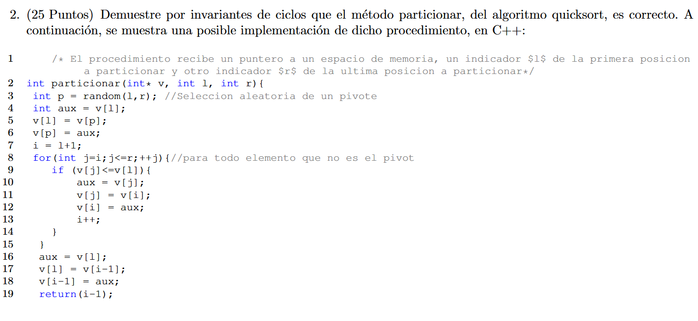

<!-- _class: title -->
# Ayudantía 3
- Carlos Lagos - carlos.lagosc@usm.cl  
- Nangel Coello - nangel.coello@usm.cl  
- Rafael Baeza - rafael.baezam@usm.cl  
- Benjamín Cárdenas - benjamin.cardenas@usm.cl 

---

# Análisis Amortizado

## ¿Qué es?

En un análisis de este tipo, el tiempo requerido para llevar a cabo una secuencia de operaciones sobre una estructura de datos es promediado sobre todas las operaciones.

---

# Análisis Amortizado

## ¿Cuándo se usa?

Cuando se desea mostrar que el costo promedio de una operación es pequeño, aun cuando una única ejecución de la operación podría ser muy costosa.

---

# Análisis Amortizado

## Diferencias con Caso Promedio

No utiliza probabilidades, ya que en este caso se garantiza el comportamiento promedio de cada operación en el peor caso.

---

# Análisis Amortizado

## Método de Agregación

Primero se muestra que, para todo $n$, una secuencia de $n$ operaciones sobre una estructura de datos toma tiempo de peor caso $T(n)$.

Luego se puede concluir que en el peor caso, el costo amortizado por operación es $T(n)/n$.

Este costo aplica para cualquiera de las operaciones realizadas dentro de la secuencia, independiente del costo o tipo de operación.

---

# Análisis Amortizado
## Ejercicios

1. Se ejecuta una secuencia de n operaciones sobre una estructura de datos. La $i$-ésima operación tiene un costo de $i$ si $i$ es una potencia de $2$, y de $1$ en caso contrario. En este contexto, se busca determinar el costo amortizado por operación

2. Reto: Debes diseñar una estructura llamada `mincola`, que soporte las operaciones de obtener el elemento al frente, sacar el elemento del frente, insertar un elemento al final, y obtener el valor mínimo de la cola. La implementación debe usar únicamente pilas y garantizar un costo amortizado de $O(1)$ por operación.

---

# Correctitud

---

<h2 style="font-size:400px;">FIN</h2>

