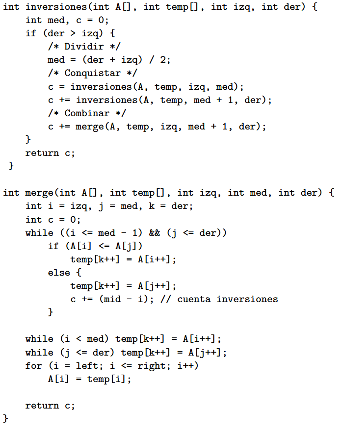

<!-- _class: title -->
# Ayudantía 4
- Carlos Lagos - carlos.lagosc@usm.cl  
- Nangel Coello - nangel.coello@usm.cl  
- Rafael Baeza - rafael.baezam@usm.cl  
- Benjamín Cárdenas - benjamin.cardenas@usm.cl 

---

# Dividir y Conquistar

Dividir y conquistar es una técnica de diseño de algoritmos que implica dividir un problema en subproblemas más pequeños y manejables, resolver cada uno de estos subproblemas de forma recursiva, y luego combinar las soluciones de los subproblemas para obtener la solución del problema original.

---

# Dividir y Conquistar

## Notación de Recurrencia

$$T(n) = aT\left(\frac{n}{b}\right) + O(n^d)$$

$$T(n) =
\begin{cases}
O(n^d) & \text{si } d > \log_b a \\
O(n^d \log n) & \text{si } d = \log_b a \\
O(n^{\log_b a}) & \text{si } d < \log_b a
\end{cases}$$

---

# Ejercicio

<style scoped>
    p,li{
        font-size:23px;
    }
    pre{
        font-size:14px;
    }
</style>

<div style="display:flex; justify-content: center;">


<div style="width:50%; display: flex; justify-content: center;flex-direction:column; padding:10px;">

## Subarreglo con Suma Máxima

Se presenta un algoritmo que utiliza la técnica de dividir y conquistar para encontrar el subarreglo contiguo con la suma máxima dentro de un arreglo de números enteros.

Determina la complejidad del algoritmo aplicando el Teorema del Maestro.

- ¿Cuál es la complejidad temporal del algoritmo?
- ¿Cuál es la complejidad espacial del algoritmo?

</div>


<div style="width:50%;">

```c++
int maxSubArray(int A[], int izq, int der) {
    if (der - izq + 1 == 1)
        return A[izq];
    else {
        // Dividir
        int m = (izq + der) / 2;

        // Conquistar
        int s1 = maxSubArray(A, izq, m);
        int s2 = maxSubArray(A, m + 1, der);

        // Combinar
        int s = A[m];
        int M1 = A[m];
        for (int j = m - 1; j >= izq; j--) {
            s += A[j];
            if (s > M1) M1 = s;
        }

        s = A[m + 1];
        int M2 = A[m + 1];
        for (int j = m + 2; j <= der; j++) {
            s += A[j];
            if (s > M2) M2 = s;
        }

        return max({s1, s2, M1, M2, M1 + M2});
    }
}
```

</div>

</div>

---

# Ejercicio


<style scoped>
    p,li{
        font-size:23px;
    }
    pre{
        font-size:14px;
    }
</style>


<div style="display:flex; justify-content: center;">


<div style="width:50%; display: flex; justify-content: center;flex-direction:column; padding:10px;">

## Conteo de Inversiones

Sea $A[1..n]$ un arreglo de $n$ números enteros. Un par $(A[i], A[j])$, con $1 ≤ i < j ≤ n$, es una inversión si $A[i] > A[j]$.

Se te entrega un algoritmo basado en la técnica de dividir y conquistar que cuenta el número de inversiones en un arreglo.

Tu tarea es analizar el algoritmo utilizando el Teorema del Maestro.

- ¿Cuál es la complejidad temporal del algoritmo?
- ¿Cuál es la complejidad espacial del algoritmo?

</div>


<div style="width:50%; display: flex; justify-content: center; align-items:center;">



</div>

</div>

---

<div align="center">
<h2 style="font-size:400px;">FIN</h2>
</div>
